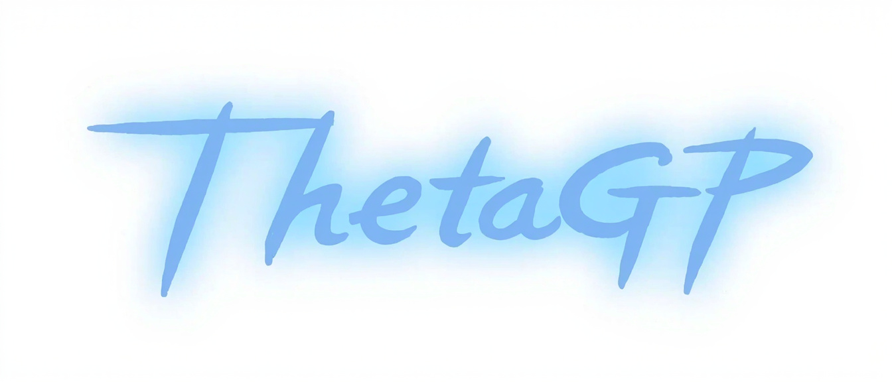

# ThetaGP

<p align="center">
  
</p>

Universal gamepad firmware: USB HID plus a CDC command channel, configured per
board. No RTOS, no dynamic allocation.

## Features

- USB HID gamepad (GP2040-CE compatible button mapping); scan-matrix keypad
- CDC command channel carrying protobuf frames (schema: `ThetaGP.PB`)
- TOML board configuration, validated and generated at configure time
- Statically allocated, cooperative task scheduler

## Quick Start

```bash
cmake -B build -DTARGET=BoringTechH743   # fetches dependencies
cmake --build build
probe-rs run --chip <CHIP> build/ThetaGP_*.elf
```

Needs CMake 3.22+, `arm-none-eabi-gcc`, Python 3.11+ and probe-rs.

## Layout

```
configs/    per-board TOML and its generated BoardConfig.h / board_config.cmake
platform/   MCU ports (STM32H7)
scripts/    build tooling and host tools
src/        firmware: wire/ (protocol), drivers/, gamepad/, utils/
lib/        third-party, fetched at configure time
```

Board configuration is TOML under `configs/<TARGET>/BoardConfig.toml`; see
`configs/CONFIGURATION.md` for the fields.

## Dependencies

Declared in `lib/CMakeLists.txt` and fetched at configure. Branch-tracking
libraries are checked once a day; the protocol schema is pinned to a tag.

| Library | Purpose |
|---|---|
| TinyUSB | USB device stack |
| frozen | JSON parser behind `src/utils/json` (profile bodies) |
| nanopb | protobuf codec for the wire |
| mbedTLS | fetched, not linked |
| ThetaGP.PB | the protocol schema (pinned) |

## License

GPL-3.0
